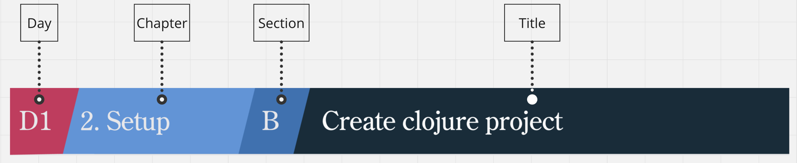

# training-clojure-snippet
Snippets from training `Clojure immersion, by Defsquare`

This repository is organised by day and follows an index

  

Whenever this icon  appears on the top right of a slide, a snippet is available on the corresponding markdown file.

[DAY 1](day-1.md)  
[DAY 2](day-2.md)  
[DAY 3](day-3.md)  
[DAY 4](day-4.md)

